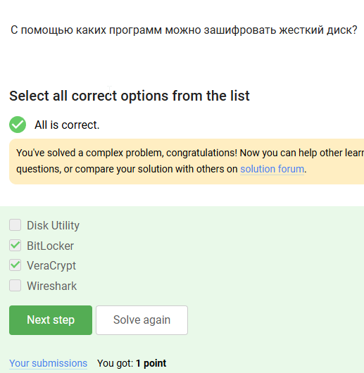
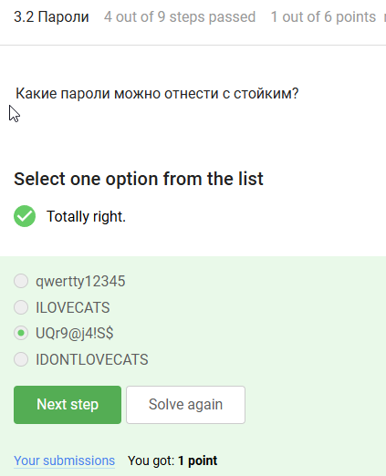
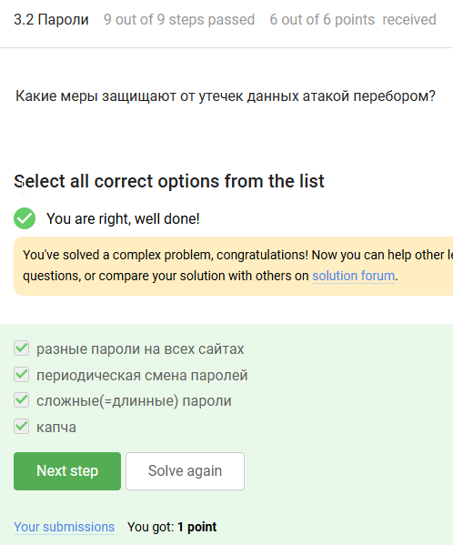
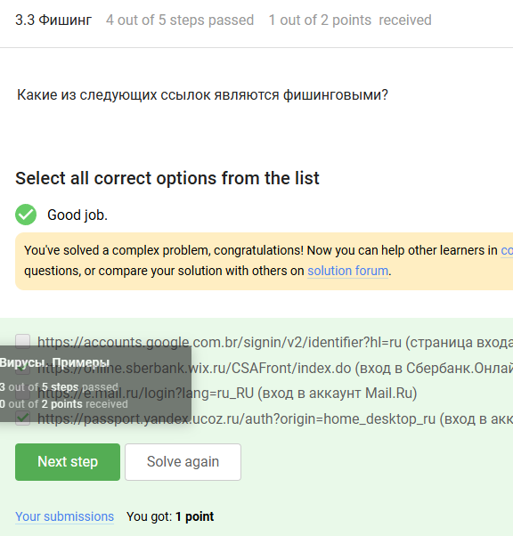
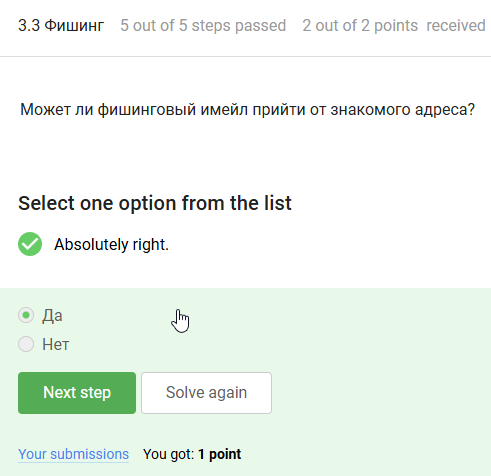

---
## Front matter
lang: ru-RU
title: Лабораторная работа № 1
subtitle: Основы информационной безопасности
author:
  - Перегудов А.В.
institute:
  - Российский университет дружбы народов, Москва, Россия
date: 22 февраля 2025

## i18n babel
babel-lang: russian
babel-otherlangs: english

## Fonts
mainfont: PT Serif
romanfont: PT Serif
sansfont: PT Sans
monofont: PT Mono
mainfontoptions: Ligatures=TeX
romanfontoptions: Ligatures=TeX
sansfontoptions: Ligatures=TeX,Scale=MatchLowercase
monofontoptions: Scale=MatchLowercase,Scale=0.9

## Formatting pdf
toc: false
toc-title: Содержание
slide_level: 2
aspectratio: 169
section-titles: true
theme: metropolis
header-includes:
 - \metroset{progressbar=frametitle,sectionpage=progressbar,numbering=fraction}
 - '\makeatletter'
 - '\beamer@ignorenonframefalse'
 - '\makeatother'
---

# Информация

## Докладчик

  * Перегудов Александр Вадимович
  * Студент группы НКАбд-03-23
  * Российский университет дружбы народов
  * [1132239659@pfur.ru]
  * <https://github.com/magister6239/study_2024-2025_infosec-intro>

# Вводная часть

## Актуальность

## Объект и предмет исследования

## Цели и задачи

## Материалы и методы

{width=70%}

{width=70%}

{width=70%}

{width=70%}

{width=70%}

{width=70%}

{width=70%}

{width=70%}

{width=70%}

{width=70%}

{width=70%}

{width=70%}
